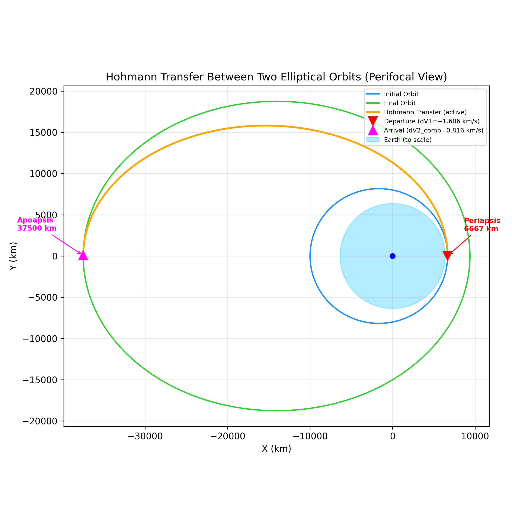
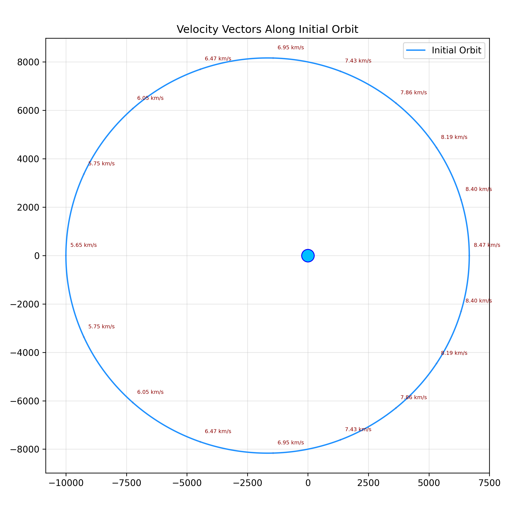
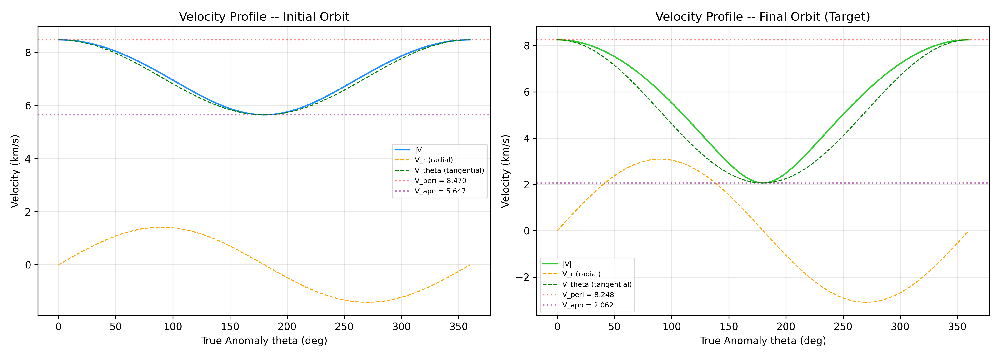

# 3D Hohmann Transfer & Inclination Change Simulation

A high-fidelity numerical solver and visualizer for orbital transfers in three dimensions. This project simulates a 3D Hohmann transfer between two elliptical orbits around Earth, including a combined speed and plane change burn at the apoapsis of the final target orbit to minimize fuel/delta-V requirements.

---

## 1. Project Aims & Objectives

1. **Orbital Modeling:** Solve Keplerian orbit geometries under two-body Newtonian gravity using eccentricity ($e$) and semi-latus rectum ($p$).
2. **Transfer Optimization:** Implement a 3D Hohmann transfer starting from the periapsis of an initial inclined elliptical orbit and concluding at the apoapsis of a highly-inclined target elliptical orbit.
3. **Plane Change Combination:** Compute a vector-based combined burn at arrival (combining prograde speed adjustments with an inclination tilt $\Delta i = 23.10^\circ$) to demonstrate fuel savings over separate, sequential burns.
4. **Visual Analytics:** Produce publication-quality plots of 2D perifocal orbits, velocity vector maps, velocity profiles, and export a dual-panel MP4 animation showing a 2D satellite trajectory side-by-side with an isometric 3D orbital-elements diagram.

---

## 2. Physics & Mathematical Formulation

### A. Keplerian Orbit Geometry
The position of a satellite in its perifocal (orbital plane) coordinate system is defined as a function of the true anomaly $\theta$ (angle from periapsis):

$$r(\theta) = \frac{p}{1 + e \cos \theta}$$

Where:
*   $r$ is the radial distance from the primary focus (Earth's center).
*   $e$ is the orbit eccentricity ($e = 0$ is circular, $0 < e < 1$ is elliptical).
*   $p$ is the semi-latus rectum, related to the semi-major axis $a$ by:

$$p = a(1 - e^2)$$

### B. Orbital Velocity Components
Using the specific angular momentum $h = \sqrt{\mu p}$ (where $\mu = 398,600 \text{ km}^3/\text{s}^2$ is Earth's gravitational parameter), the velocity vector is decomposed into radial ($v_r$) and tangential ($v_\theta$) components:

$$v_r = \frac{\mu}{h} e \sin \theta$$

$$v_\theta = \frac{h}{r}$$

The overall velocity magnitude at any point is:

$$v = \sqrt{v_r^2 + v_\theta^2} = \sqrt{\mu \left(\frac{2}{r} - \frac{1}{a}\right)}$$

### C. 3D Coordinates Transformation (Perifocal to ECI)
Perifocal coordinates are calculated as:

$$x_{pf} = r \cos \theta, \quad y_{pf} = r \sin \theta, \quad z_{pf} = 0$$

To represent this orbit in a 3D Earth-Centered Inertial (ECI) frame, we apply rotations using the inclination $i$ and the argument of perigee $\omega$ (assuming the Right Ascension of the Ascending Node $\Omega = 0$):

$$\mathbf{r}_{ECI} = R_z(-\Omega) R_x(-i) R_z(-\omega) \mathbf{r}_{pf}$$

Since $\Omega = 0$, the transformation equations simplify to:

$$x_{rot} = x_{pf} \cos\omega - y_{pf} \sin\omega$$

$$y_{rot} = x_{pf} \sin\omega + y_{pf} \cos\omega$$

$$x_{3d} = x_{rot}$$

$$y_{3d} = y_{rot} \cos i$$

$$z_{3d} = y_{rot} \sin i$$

### D. 3D Hohmann Transfer & Delta-V Calculations
The transfer orbit departs at the periapsis of Orbit 1 ($r_{peri,1}$) and arrives at the apoapsis of Orbit 2 ($r_{apo,2}$).

1.  **Transfer Orbit Geometry:**
    $$a_{transfer} = \frac{r_{peri,1} + r_{apo,2}}{2}$$
    
    $$e_{transfer} = \frac{r_{apo,2} - r_{peri,1}}{r_{apo,2} + r_{peri,1}}$$

2.  **Burn 1: Departure Burn (at $r_{peri,1}$ in Orbit 1's plane):**
    The satellite accelerates from its initial orbital speed ($v_{1,dep}$) to the transfer orbit periapsis speed ($v_{t,dep}$):
    $$\Delta V_1 = v_{t,dep} - v_{1,dep} = \sqrt{\mu \left(\frac{2}{r_{peri,1}} - \frac{1}{a_{transfer}}\right)} - \sqrt{\mu \left(\frac{2}{r_{peri,1}} - \frac{1}{a_1}\right)}$$

3.  **Burn 2: Combined Arrival & Plane Change Burn (at $r_{apo,2}$):**
    Upon arrival at the apoapsis, the satellite must transition from the transfer orbit speed ($v_{t,arr}$) to the final orbit speed ($v_{2,arr}$) while rotating its orbital plane by $\Delta i = i_2 - i_1$. Applying the law of cosines to the velocity vectors yields:
    $$\Delta V_{2,comb} = \sqrt{v_{t,arr}^2 + v_{2,arr}^2 - 2 v_{t,arr} v_{2,arr} \cos(\Delta i)}$$

    *Comparison:* Performing these burns separately would require:
    $$\Delta V_{2,separate} = |v_{2,arr} - v_{t,arr}| + 2 v_{t,arr} \sin\left(\frac{\Delta i}{2}\right)$$
    The vector-combined single burn saves substantial fuel (represented by $\Delta V_{savings} = \Delta V_{2,separate} - \Delta V_{2,comb}$).

4.  **Transfer Time of Flight (TOF):**
    $$T_{OF} = \frac{T_{transfer}}{2} = \pi \sqrt{\frac{a_{transfer}^3}{\mu}}$$

---

## 3. Quantitative Simulation Results

Below is the summary of the simulated Hohmann transfer between the initial Cape Canaveral-like orbit and the highly-inclined target orbit:

| Parameter | Initial Orbit (1) | Hohmann Transfer Orbit | Final Orbit (2) |
| :--- | :--- | :--- | :--- |
| **Orbit Classification** | Elliptical (LEO/MEO) | Elliptical Transfer | Elliptical (LEO/MEO) |
| **Eccentricity ($e$)** | 0.200000 | 0.698113 | 0.600000 |
| **Semi-major axis ($a$)** | 8,333.33 km | 22,083.33 km | 23,437.50 km |
| **Periapsis Alt ($h_{p}$)**| 295.67 km | 295.67 km | 3,004.00 km |
| **Apoapsis Alt ($h_{a}$)** | 3,629.00 km | 31,129.00 km | 31,129.00 km |
| **Inclination ($i$)** | $28.50^\circ$ | $28.50^\circ$ | $51.60^\circ$ |
| **Arg of Perigee ($\omega$)**| $45.00^\circ$ | $45.00^\circ$ | $120.00^\circ$ |
| **Orbital Period ($T$)** | 126.18 min | 544.32 min (full) | 595.15 min |

### Delta-V Breakdown:
*   **Burn 1 (Departure):** $+1.6058 \text{ km/s}$ (Prograde)
*   **Burn 2 (Arrival combined):** $0.8158 \text{ km/s}$ (Speed change + $23.10^\circ$ plane change)
*   **Delta-V Savings (Combined vs. Separate Burns):** $0.1722 \text{ km/s}$
*   **Total Delta-V Requirement:** **$2.4216 \text{ km/s}$**
*   **Transfer Time of Flight (TOF):** **4.5360 hours** (272.16 minutes)

---

## 4. Project Directory Structure

*   [Orbital transfer.py](file:///e:/Coding%20work/Antigravity/S1/Orbital_Mechanics/Orbital%20transfer.py) - Core Python script that runs the equations, handles coordinates transformations, generates plots, and executes the dual-panel matplotlib animation.
*   [orbital_transfer_results.txt](file:///e:/Coding%20work/Antigravity/S1/Orbital_Mechanics/orbital_transfer_results.txt) - Programmatically printed detailed numerical logs for the orbits and transfer.
*   [plot1_perifocal.png](file:///e:/Coding%20work/Antigravity/S1/Orbital_Mechanics/plot1_perifocal.png) - 2D perifocal view of Initial Orbit, Transfer Arc, and Target Orbit, displaying burn points and Earth to scale.
*   [plot2_velocity_vectors.png](file:///e:/Coding%20work/Antigravity/S1/Orbital_Mechanics/plot2_velocity_vectors.png) - Vector map of velocity directions and magnitudes at select intervals along the initial trajectory.
*   [plot3_velocity_profile.png](file:///e:/Coding%20work/Antigravity/S1/Orbital_Mechanics/plot3_velocity_profile.png) - Double profile panel matching total, radial, and tangential velocities across $360^\circ$ of True Anomaly.
*   [orbit_animation.mp4](file:///e:/Coding%20work/Antigravity/S1/Orbital_Mechanics/orbit_animation.mp4) - Rendered dual-panel animation comparing the orbital flight trail with an active 3D orbital plane coordinate diagram (True/Mean anomaly, inclination and perigee arguments readouts).

---

## 5. Visualizations

### 2D Perifocal Orbit & Transfer Path


### Velocity Vector Distribution


### Velocity Profile (Initial vs. Target Orbit)


---

## 6. Execution Guide

### Requirements
*   Python 3.x
*   Dependencies: `numpy`, `matplotlib`
*   Animation saving (optional): `ffmpeg` installed and added to your system PATH.

### Running the Simulation
Execute the script using:
```bash
python "Orbital transfer.py"
```
*Note: The script runs dynamically, pops up static diagnostic figures, launches a live interactive dual-panel simulation of the satellite coasting and burning, and asks if you would like to render and save the file to `orbit_animation.mp4`.*
